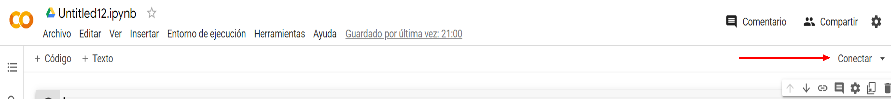

# **Automatización del Flujo de Trabajo sobre el Proyecto Final del curso de Introducción a los Mercados Bursátiles con la librería pyportfolioanalytics en Python**
#### **Realizado por Sebastian Marat Urdanegui Bisalaya**

<br>

<div style = "text-align:center">
    
    
<div>

<div style = "text-align:left">
<div>
<br>

<br>
<br>

## **¿Qué te permite hacer la librería pyfinancialanalysis?**

<br>

## **¿Cuáles son los pasos que debo seguir para utilizar correctamente la librería?**

<br>

### **1. El camino más directo**
El camino más directo es usar la platforma Google Colab [Clic aquí para usar Google Colab](https://colab.research.google.com/). Google Colaboratory es un cuaderno de trabajo de Jupyter almacenado en la nube que te permite escribir código en Python y procesarlo de forma ágil. **Solo necesitas tener una cuenta de Google Gmail para acceder.**

Al hacer clic en el enlace, obtendrás como output el entorno de Google Colab:



Deberás hacer clic en el botón <span style = "color:orange">**Conectar**<span> <span style = "color:white">para encender la máquina virtual de Google Colaboratory y poder correr código Python.

Luego, en la primera línea de código es importante copiar y pegar el siguiente código para evitar inconvenientes entre dependencias. **(Control + Enter para correr el código de la celda)**
<br>

```python
!apt-get install -y python3-dev libffi-dev libcairo2-dev
```
Ahora, es hora de instalar la librería <span style = "color:orange">pyportfolioanalytics:<span> <span style = "color:white"><span>

```python
pip install pyportfolioanalytics==0.0.7
```

Por último, para iniciar a tirar código, debemos importar las librerías que serán necesarias para el trabajo a realizar:

```python
from pyportfolioanalytics.utils import stock_price_close
from pyportfolioanalytics.utils import return_daily
from pyportfolioanalytics.utils import covariance_matrix
from pyportfolioanalytics.utils import plot_price_close
from pyportfolioanalytics.utils import histogram_yield
from pyportfolioanalytics.utils import plot_yield_deviation_mean
from pyportfolioanalytics.utils import plot_cov_matrix
from pyportfolioanalytics.utils import plot_corr_matrix
from pyportfolioanalytics.utils import plot_logarithmic_yield
from pyportfolioanalytics.utils import BuySellStocks
from pyportfolioanalytics.utils import ReportFinancial
```

**<span style="color:orange">¡Listo!<span> <span style="color:white">Tienes todo lo necesario para realizar un análisis financiero en Python<span>**

### **Caso 1: Obtener los precios de cierre de las acciones de Apple (AAPL), Amazon (AMZN) y Netflix (NFLX) entre el periodo de 2022-01-01 y 2023-03-31**

```python
# Almacenar en una variable los datos que se obtendrán
dataframe_stock = stock_price_close(stock_list = ["AAPL", "AMZN", "NFLX"], start = "2022-01-01", end = "2023-03-31")
```

### **Output Caso 1**

### **Caso 2: Obtener un gráfico de la evolución de los precios de cierre de las acciones**

```python
# Retornará un gráfico de la evolución del precio de cierre en el periodo en cuestión
plot_price_close(["AAPL", "AMZN", "NFLX"], "2022-01-01", "2023-01-01")
```

### **Output Caso 2**

### **Caso 3: Obtener un gráfico del rendimiento de las acciones**

```python

```

### **Output Caso 3**

### **Caso 4: Obtener un histograma del rendimiento de las acciones**

```python

```

### **Output Caso 4**

### **Caso 5: Obtener una matriz de correlación entre el rendimiento de las acciones**

```python

```

### **Output Caso 5**

### **Caso 6: Presentar un reporte financiero con los insights más relevantes**

```python
# Este código se encarga de traer la instancia de la clase ReportFinancial con el objetivo de construir automáticamente un reporte financiero con los insights más relevantes
reporte = ReportFinancial(["AAPL", "AMZN", "NFLX"], "2022-01-01", "2023-03-31", [0.8, 0.1, 0.1], 10000)
reporte.report()
```

### **Ouput Caso 6**


